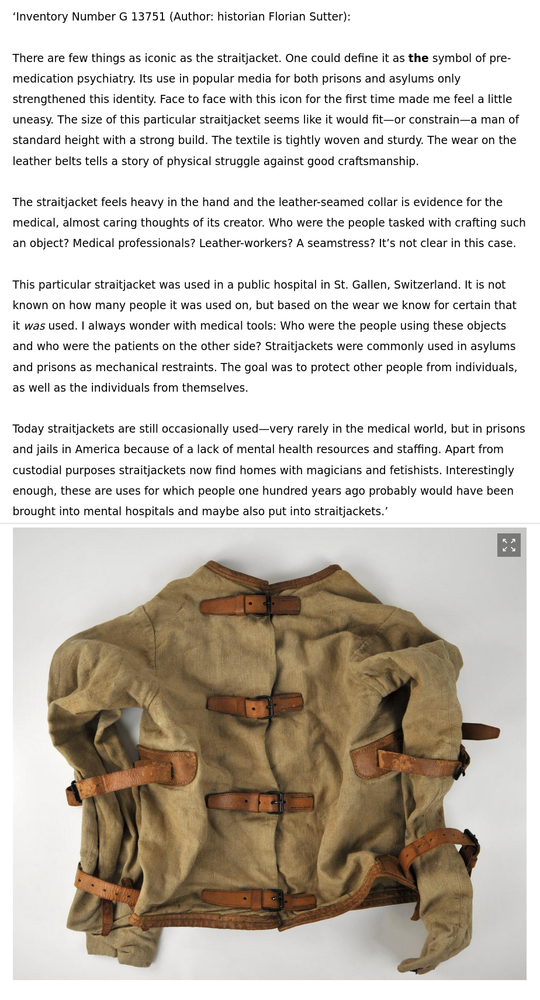

### Digital Databases and Reaching the Fundamental Goal of ***Feeling the Past***

Databases are a historian's window into a digital archive or a modern collection. Their structure influences the way we select sources and shape our research. Naturally, they tend to focus on their job as archival tools rather than a historian's research help. While a considerable amount of writing discusses how archives influence historians (see for example: [Farge, 1989](bibliography.md#farge-1989) / [Trouillot, 1995](bibliography.md#trouillot-1995)), there is still more work to be done regarding which impact the digital advancements of the past decades had on the way we conduct our research today. One example is Lara Putnam's article on "The Transnational and the Text-Searchable" ([2016](bibliography.md#putnam-2016)). She examines how source digitization has transformed the work of historians, especially with an eye on transnational research. In relation to my project, an important part is her citing of a study by Ian Milligan, which showed that in the wake of digitization the citations of two newspapers increased tenfold while citations of their non-digitized contemporaries stayed steady or fell (p. 388, [Milligan, 2013](bibliography.md#milligan-2013)). This has important implications on *Feeling the Past's* contribution to the mechanics of historical source selection.

For one, digitization seems to be a key component to the solution of the abovementioned lack of awareness. As more and more source research and source work itself is being done digitally, trying to facilitate finding objects for historians using this channel seems to be natural. Like I already mentioned, most databases are created focusing on their archival task, rather than to support historical research. Therefore one option of getting more objects into historical research would be reconceptualizing digital data-sets, something I tried in *Feeling the Past's* third task with the presentation of the straitjacket in the style of Neil MacGregor's *A History of the World in 100 Objects* (see below), based both on the original data-set of the HVM and my personal impressions of the object. By focusing on different aspects of the object, like questions regarding its social context or production, already on the level of the data-set the work of a historian can be facilitated or supported, and thanks to the digital format continuously expanded. Another possibility is the addition of the third dimension, like a 3D digitization project of the Smithsonian Collections currently is pursuing. The project uses three-dimensional capture technology to create digital representations of objects from the collections of the Smithsonian and distributes them on a [publicly accessable website](https://3d.si.edu/). While these approaches definitly are steps in the right direction, it will not change much if another fundamental problem is not solved: Access.

Similar disparaties in access to digital sources ([Putnam, 2016](bibliography.md#putnam-2016), p. 389), can be found with objects. The collection of the Historisches und Völkerkundemuseum St.Gallen for example includes around 80'000 objects, which are inventoried in an internal digital database. Thanks to this database, to which I have access because I work in the HVM, I was able to find the objects used in *Feeling the Past*. There exists a [public online database](http://www.online-collection.ch/), which only displays 8'000 data-sets, 10 per cent of the whole collection. 90 per cent are therefore not available to the public and cannot be found without internal access. I think this contributes to the preference for text over objects, as historians are simply not aware of all the objects they could potentially use as sources. By making their databases online, collections would faciliate a historian's search for interesting objects.

*The following picture is a screenshot from Feeling the Past. It shows the straitjacket, which is one of the choices of the third task, and the reconceptualized description based on the style of Neil MacGregor's A History of the World in 100 Objects.* 

